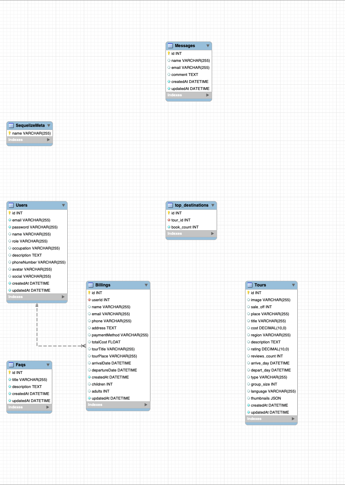

# ERD Database Documentation

## Overview

This documentation provides an overview of the Entity-Relationship Diagram (ERD) for the Tripster platform. The database schema is designed to manage users, tours, billing, messages, FAQs, and top destinations, ensuring a comprehensive backend for a travel and booking system.

## Database Schema

The database schema consists of the following entities:

### Users

Represents the users of the platform.

- **Fields:**
  - `id`: Unique identifier for the user.
  - `email`: Email address of the user.
  - `password`: Encrypted password.
  - `name`: Full name of the user.
  - `occupation`: User's occupation (optional).
  - `description`: Brief description of the user (optional).
  - `phoneNumber`: User's contact number.
  - `social`: Social media link (optional).
  - `avatar`: URL to the user's profile picture (optional).
  - `createdAt`: Timestamp of record creation.
  - `updatedAt`: Timestamp of the last update.

### Messages

Stores messages or inquiries from users.

- **Fields:**
  - `id`: Unique identifier for the message.
  - `name`: Name of the sender.
  - `email`: Email address of the sender.
  - `comment`: Content of the message.
  - `createdAt`: Timestamp of message creation.
  - `updatedAt`: Timestamp of the last update.

### Billings

Stores details about user bookings and payments.

- **Fields:**
  - `id`: Unique identifier for the billing record.
  - `userId`: Foreign key linking to the `Users` table.
  - `name`: Name of the user.
  - `email`: User's email.
  - `phone`: User's phone number.
  - `address`: User's billing address.
  - `paymentMethod`: Method of payment (e.g., credit card, PayPal).
  - `totalCost`: Total cost of the booking.
  - `tourTitle`: Title of the booked tour.
  - `tourPlace`: Destination of the tour.
  - `arrivalDate`: Arrival date for the booking.
  - `departureDate`: Departure date for the booking.
  - `children`: Number of children in the booking.
  - `adults`: Number of adults in the booking.
  - `createdAt`: Timestamp of record creation.
  - `updatedAt`: Timestamp of the last update.

### FAQs

Stores frequently asked questions and answers.

- **Fields:**
  - `id`: Unique identifier for the FAQ.
  - `title`: Question title.
  - `description`: Detailed answer.
  - `createdAt`: Timestamp of record creation.
  - `updatedAt`: Timestamp of the last update.

### Tours

Represents tours available for booking.

- **Fields:**
  - `id`: Unique identifier for the tour.
  - `image`: URL to the tour's image.
  - `sale_off`: Discount percentage (optional).
  - `place`: Destination name.
  - `title`: Title of the tour.
  - `cost`: Cost of the tour.
  - `region`: Region where the tour is located.
  - `description`: Detailed description of the tour.
  - `rating`: Rating for the tour (out of 5).
  - `reviews_count`: Number of reviews for the tour.
  - `arrive_day`: Arrival date for the tour.
  - `depart_day`: Departure date for the tour.
  - `type`: Type of tour (e.g., adventure, leisure).
  - `group_size`: Maximum group size for the tour.
  - `language`: Language(s) supported during the tour.
  - `thumbnails`: JSON field storing additional images.
  - `createdAt`: Timestamp of record creation.
  - `updatedAt`: Timestamp of the last update.

### Top Destinations

Tracks the most popular destinations based on bookings.

- **Fields:**
  - `id`: Unique identifier for the record.
  - `tour_id`: Foreign key linking to the `Tours` table.
  - `book_count`: Number of bookings for the tour.

### SequelizeMeta

Used for tracking database migrations (managed by Sequelize ORM).

- **Fields:**
  - `name`: Name of the migration.

## Indexes and Relationships

- `Users` has a one-to-many relationship with `Billings`.
- `Billings` includes user details and tour booking information.
- `Tours` and `Top Destinations` are linked by `tour_id`, helping to identify popular tours.

---

This database schema is optimized to handle various functionalities, including user management, bookings, messaging, FAQs, and analytics for popular destinations. It ensures a scalable and efficient backend for the Tripster platform.

